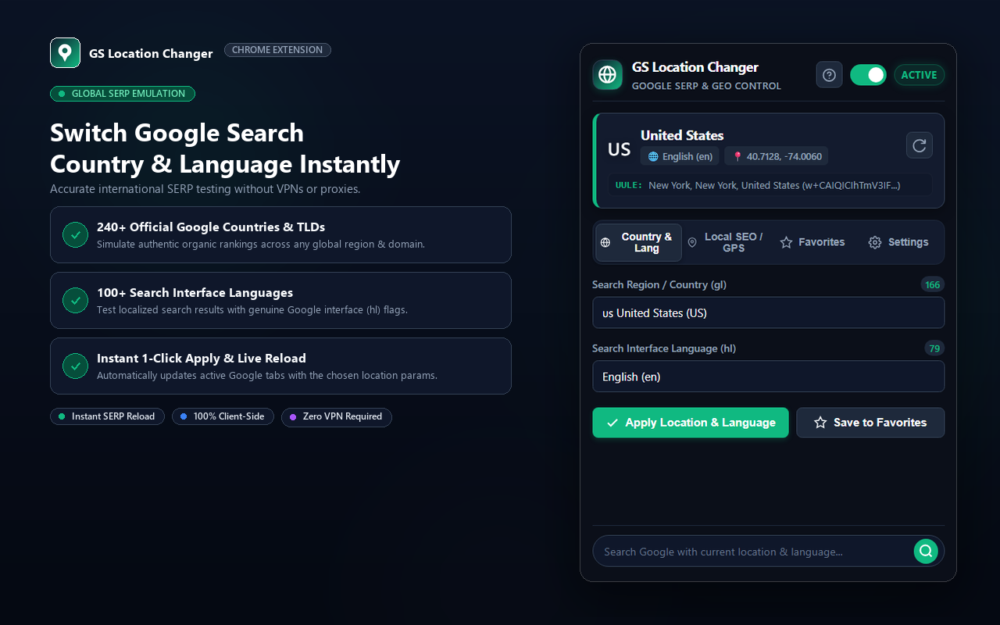

# GS Location Changer - Google Search Location & Language Chrome Extension

<p align="center">
  
</p>

**GS Location Changer** is a modern, enterprise-grade Chrome Extension (Manifest V3) built for SEO professionals, digital marketers, international researchers, and privacy-conscious users. It allows you to effortlessly control Google Search's region (`gl`), interface language (`hl`), language restrict (`lr`), HTML5 Geolocation coordinates (`lat/lng`), and canonical Local SEO protobuf strings (`uule`).

---

## 🌟 Key Features

1. **Google Countries & Regional Domains (`gl`)**:
   - Includes **166 Google-supported countries and territories** with country flags, ISO codes, and native ccTLD routing (e.g., `google.co.uk`, `google.de`, `google.com.pk`).
   - Searchable, instant-filter dropdown with full **keyboard navigation** (ArrowUp, ArrowDown, Enter, Escape).

2. **Google Supported Languages (`hl` & `lr`)**:
   - Includes **79 global languages** (English, Urdu, Arabic, Hindi, Spanish, French, German, Japanese, Chinese, etc.) with native scripts and correct `lr` restrict mapping.

3. **Precise Local SEO & Coordinates Spoofing (Latitude & Longitude)**:
   - Enter exact GPS coordinates (-90 to 90 lat, -180 to 180 lng) with accuracy control.
   - **Fail-Closed Geolocation Emulation**: Overrides `navigator.geolocation.getCurrentPosition`, `watchPosition`, `clearWatch`, and `navigator.permissions.query`. If coordinates are unassigned while spoofing is enabled, it blocks location requests to prevent real physical GPS leaks.

4. **Protobuf Google UULE Generator**:
   - Encodes any city or area name (e.g., `Chicago, Illinois, United States`, `لاہور, پنجاب, پاکستان`, or `München, Bayern, Germany`) into Google's official canonical Protobuf `uule` parameter (`w+CAIQICI...`).
   - Supports multi-byte UTF-8 international characters and lengths exceeding 64 characters with protobuf varints.

5. **1-Click Favorites & Presets**:
   - Save custom presets with one click (Country + Language + Coordinates + UULE).
   - Pre-loaded with popular SEO hubs (New York, London, Berlin, Dubai, Lahore, etc.).
   - Secure import and export as JSON with strict schema validation and XSS immunity.

6. **Live Toolbar Icon Badge & Status**:
   - Dynamic toolbar badge displays the 2-letter country code (e.g. `US`, `GB`, `PK`, `DE`) with a green indicator when active, or `OFF` when disabled.
   - Automatically restored on browser startup (`chrome.runtime.onStartup`).

7. **Popup Quick Search with ccTLD Routing**:
   - Type any query directly in the popup's search bar to launch Google Search with your selected location and language parameters routed to the native ccTLD.

8. **Non-Personalized Search (`pws=0`)**:
   - Toggle unbiased, raw search rankings by stripping personal history bias.

---

## 📂 Project Structure

```
GS Location Changer/
├── manifest.json              # Chrome Manifest V3 configuration
├── background/
│   └── service-worker.js      # Service worker: badge, URL sync & ccTLD routing
├── content/
│   ├── content.js             # Content script bridge for Google tabs
│   └── inject-geo.js          # Synchronous DOM geolocation & permissions shim
├── popup/
│   ├── popup.html             # 2026 modern popup layout with ARIA accessibility
│   ├── popup.css              # High-contrast design system (WCAG AAA)
│   └── popup.js               # UI controls, keyboard navigation & XSS-immune rendering
├── data/
│   ├── countries.js           # 166 Google-supported countries with flags & domains
│   ├── languages.js           # 79 Google languages with lr mapping
│   └── presets.js             # Global city presets and coordinates
├── utils/
│   └── uule-generator.js      # Canonical Google Protobuf UULE encoder & decoder
├── test/
│   └── uule.test.js           # Automated regression test suite
├── icons/
│   ├── icon16.png
│   ├── icon32.png
│   ├── icon48.png
│   └── icon128.png
├── PRIVACY_POLICY.md          # Chrome Web Store Privacy Policy
├── LICENSE                    # MIT License
├── CHANGELOG.md               # Version 1.0.0 release log
└── README.md
```

---

## 📦 How to Install

### Method 1: Chrome Web Store (Recommended)
You can install the official version directly from the Chrome Web Store:
> **[Install from Chrome Web Store](https://chromewebstore.google.com/detail/clgaahgffldbjhlbjdphnecifgellidj)** 

---

### Method 2: Install from Source (Developer Mode)
If you want to run or test the extension directly from the source code:

1. **Clone or Download** this repository:
   ```bash
   git clone https://github.com/asadullah53/GS-Location-Changer.git
   ```
   *(Or download and extract the ZIP file from GitHub).*
2. Open Google Chrome and visit `chrome://extensions` in your address bar.
3. Enable **Developer mode** using the toggle in the top-right corner.
4. Click the **Load unpacked** button in the top-left corner.
5. Select the cloned/extracted **`GS-Location-Changer`** project directory.
6. Pin **GS Location Changer** to your Chrome toolbar.

---

## 🧪 Automated Testing

Run the built-in regression test suite:
```bash
node test/uule.test.js
```
Validates:
- Standard ASCII canonical names
- Non-ASCII international names (Urdu, Arabic, German, Spanish, Chinese)
- Varint length boundaries (> 64 characters)
- Corrupt UULE rejection & decoding
- Edge cases and empty inputs
